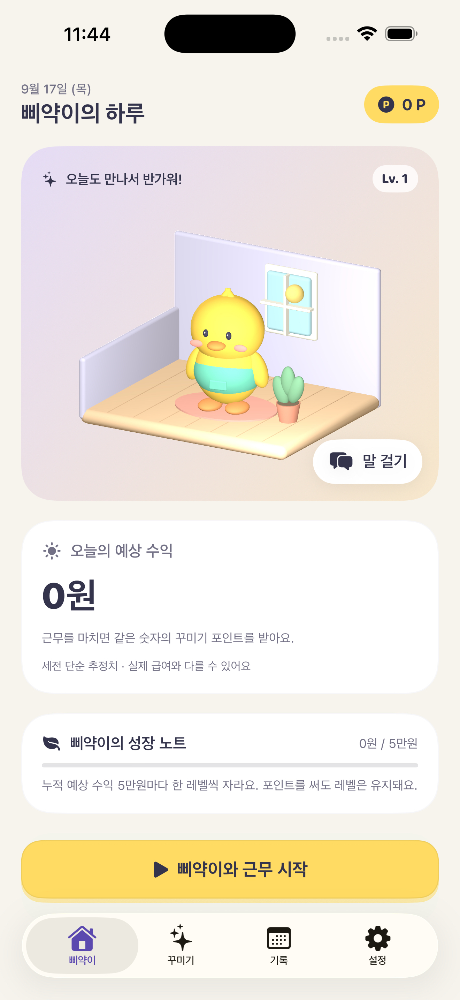
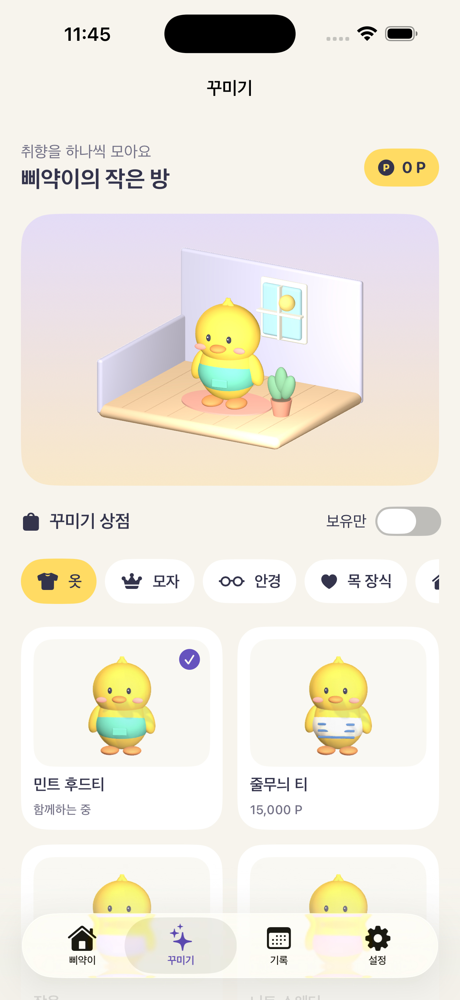
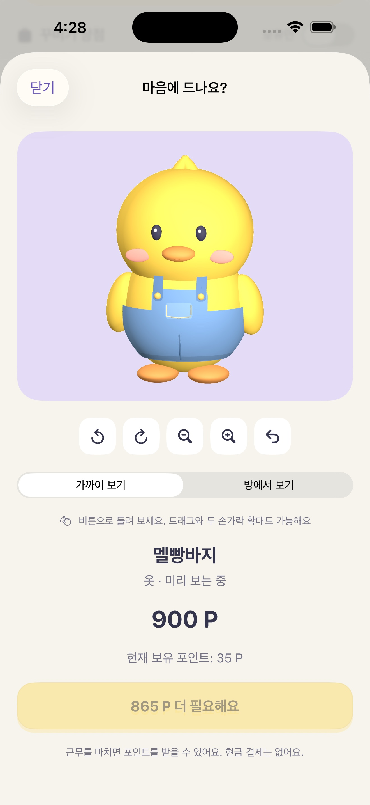

# 삐약뱅크 · PiyakBank

**일하는 나에게, 작은 친구 하나.**

시급과 근무 시간을 기록하고, 예상 수익을 가상 포인트로 모아 병아리의 방을 꾸미는 iOS · Apple Watch 앱입니다. 시간 기록에 작은 성장과 수집의 재미를 더했습니다.


첫 출시 방향은 **무료·광고 없음·회원가입 없음**입니다. 포인트는 앱 꾸미기 전용이며 현금 가치나 송금·인출 기능은 없습니다. 표시 수익은 세금과 수당을 제외한 단순 추정치입니다.

## 실제 앱 화면

  

iPhone 17 Pro Max 시뮬레이터에서 직접 캡처했습니다. 홈 화면은 새 ‘놀아주기’ 동작을 반영한 캡처로 갱신할 예정입니다. 이전 출시 후보의 레이아웃 검증 자료: [iPad 화면](docs/screenshots/ipad-home.jpg) · [다크 모드와 큰 글씨](docs/screenshots/iphone-accessibility-dark.jpg). 두 참고 화면은 이번 모델 개선 이전 모습입니다.

## 주요 기능

| 기능 | 구현 |
|---|---|
| 근무 기록 | 시작·휴식·재개·종료, 마지막 저장 상태 복구 |
| 수익 계산 | 유급 시간만 계산, 자정 분할, 날짜별 합계와 전체 금액 일치 |
| 작은 방 꾸미기 | 곡면 의상·안경·가구 등 81개 입체 아이템, 회전·확대 착용 미리보기 |
| 삐약이와 놀기 | 삐약이를 누르거나 ‘놀아주기’ 버튼으로 인사하고 장착한 가구와 상호작용 |
| 삐약이의 하루 | 바닥을 걷고, 장착한 화분·책·피아노·소파·강아지와 상호작용 |
| 성장 | 누적 예상 수익 5만원마다 레벨 상승, 아이템 구매로 레벨 감소 없음 |
| 기록 관리 | 달력, 완료 기록 수정·삭제, 누락 근무 추가, CSV 내보내기 |
| Apple Watch | iPhone 시급 동기화, 연결 상태 표시, 확인 응답을 받는 근무 제어 |
| iPhone/iPad 위젯 | 5분 단위 예상 수익, 상태 변경 시 갱신 요청 |
| 접근성과 개인정보 | Dynamic Type, VoiceOver 레이블, Reduce Motion, 다크 모드, 선택 알림 |

## 설계에서 집중한 점

### 한 가지 계산 규칙

iPhone, Watch, 위젯이 `EarningsCalculator`를 공유합니다. 시급을 먼저 3,600으로 나누면 반복 소수 오차가 발생하므로, **밀리초 × 시급**의 분자를 유지한 뒤 마지막에 정수 원 단위로 절삭합니다. 날짜별 배분에도 누적 잔여값을 넘겨 전체 금액이 보존됩니다.

휴식은 시급 0원 구간으로 표현합니다. 오늘 수익은 완료 원장과 진행 중인 근무의 **오늘 구간만** 합산합니다. 기존 버전의 정산 반올림 오차는 최초 실행 시 다시 계산하며, 구매 및 보유 내역은 유지합니다.

### 저장이 성공해야 상태가 바뀜

근무 종료와 포인트 적립을 하나의 저장 단위로 처리합니다. 실패 시 새 원장 항목을 취소하고 화면에 연결된 SwiftData 모델 값도 복원합니다. 강제 종료 복구는 UserDefaults의 보조 키가 아닌 SwiftData의 활성 근무를 기준으로 합니다.

### 늦게 도착한 워치 명령 방지

명령에는 ID, 대상 근무 ID, 생성 시각을 넣습니다. 중복·만료·다른 근무에 대한 명령을 거부하며, 오프라인 명령을 예약하지 않습니다. iPhone의 저장 확인 응답을 받아야 워치 상태를 바꿉니다.

### 같은 모델로 만드는 디자인

캐릭터, 옷, 방과 가구를 코드로 구성한 SceneKit 기하 모델로 렌더링합니다. 앱 아이콘과 상점의 81개 미리보기도 같은 모델에서 생성하므로 미리보기와 실제 착용이 일치합니다. 제3자 3D 모델이나 다운로드 자산은 없습니다.

의상과 봉제선은 몸 곡면을 따라 구성하고, 얇은 물체의 모서리 반경을 두께에 맞춰 제한합니다. 미리보기는 실제 모델 범위에 맞춰 카메라를 조정하며 생성 원본의 지문을 검사해 오래된 이미지가 남지 않게 합니다.

방 안 행동은 가구 앞쪽 통로를 따라 이동하도록 설계했고 캐릭터 관절을 사용합니다. 삐약이를 누르거나 ‘놀아주기’ 버튼을 누르면 인사하거나 장착한 가구와 상호작용합니다. 홈이 화면에 보일 때만 최대 24fps로 움직이며, 다른 탭·백그라운드·저전력·발열 경고·Reduce Motion에서는 멈춥니다. 홈에서 직접 움직임을 멈출 수도 있습니다.

[행동 프레임](docs/quality/room-activities.jpg)과 [착용 조합](docs/quality/room-combinations.jpg)에서 실제 엔진의 렌더링 결과를 확인할 수 있습니다. 오늘 예상 수익과 보유 포인트는 홈에서, 날짜별 근무 기록은 기록 탭에서 확인합니다.

## 기술 구성

SwiftUI · SwiftData · SceneKit · WatchConnectivity · WidgetKit · UserNotifications

```text
PiyakBank/
  App/         앱 시작, 서비스 연결
  Shared/      공통 계산, 스냅샷, 포인트 원장, 디자인 토큰
  Services/    근무 수명주기, 저장, 알림, 워치 통신
  Views/       홈, 입체 방, 꾸미기, 기록, 설정, 개인정보
  Watch/       Watch 동반 앱
  Widget/      iPhone/iPad 위젯
Tests/         계산 및 실제 SwiftData 회귀 테스트
scripts/       원본 모델에서 이미지 생성, 배포 리소스 검사
docs/          지원·개인정보·심사 자료·검증 기록
```

## 실행과 검증

- **빌드:** Xcode 26 이상, iOS/watchOS SDK 26 이상
- **실행:** iOS 17.0 이상, watchOS 10.0 이상
- **실기기 서명:** 본인의 Team 및 `group.com.minseo.piyakbank` App Group 설정 필요

`PiyakBank.xcodeproj`를 열고 `PiyakBank` scheme을 실행합니다. 의존 패키지, API 키, 서버 설정은 없습니다.

```sh
swift test --jobs 1
python3 scripts/check_release_assets.py
xcodebuild -project PiyakBank.xcodeproj -scheme PiyakBank \
  -configuration Release -jobs 1 -destination 'generic/platform=iOS' \
  -derivedDataPath /tmp/PiyakBank CODE_SIGNING_ALLOWED=NO build
```

이미지 재생성:

```sh
xcrun swiftc PiyakBank/Views/PiyakScene.swift scripts/GenerateAssets.swift -o /tmp/piyak-assets
/tmp/piyak-assets "$PWD"
```

GitHub Actions에서 계산·저장 회귀 테스트와 iOS/Watch/위젯 Release 빌드를 수행합니다. 상세 결과와 아직 실기기에서 확인해야 할 항목은 [검증 기록](docs/RELEASE_VALIDATION.md)을 참고하세요.

## 데이터와 배포

기록은 기기에 저장하며 개발자 서버로 전송하지 않습니다. CSV는 열람·보관용이고 가져오기 및 클라우드 동기화는 지원하지 않습니다. 위젯은 시스템의 갱신 정책을 따르는 예상치이며 watchOS 컴플리케이션은 포함하지 않습니다.

[개인정보 처리방침](docs/PRIVACY.md) · [지원 안내](docs/SUPPORT.md) · [App Store 제출 자료](docs/APP_STORE.md)

개발: **김민서** · [eric91405@gmail.com](mailto:eric91405@gmail.com)
